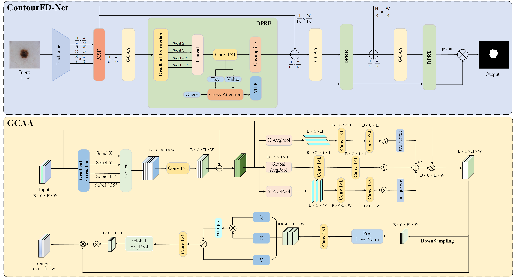
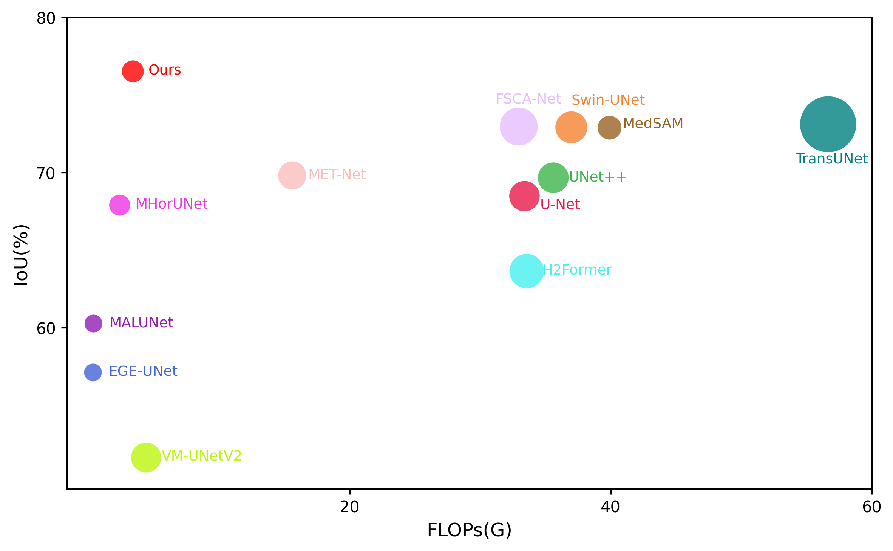

# ContourFD Net for IoT-devices
[](https://www.python.org/downloads/)
[](https://pytorch.org/get-started/locally/)
[](https://developer.nvidia.com/cuda-toolkit-archive)
**ContourFD-Net: A Finite-Difference-Driven Contour Attention Network for Efficient Medical Image Segmentation on Edge Devices**

ContourFD-Net is a contour-aware medical image segmentation network that leverages finite-difference gradient guidance and attention mechanisms to better capture lesion boundaries, especially in challenging medical images such as breast ultrasound. Its lightweight design is highly suitable for application in medical IoT devices.

<p align="center">
    
</p>
<p align="center">
    
</p>


## 🔗 Pretrained Weights

We provide pretrained weights to help reproduce the results reported in the paper.

* **Pre-trained models (four folds) – ContourFD-Net (best IoU checkpoints)**
  👉 [Download (Google Drive)](https://drive.google.com/drive/folders/1nosiIXYoeIE-2ZM8z3vHd627TvxK8cN9?usp=sharing)

### How to Use Pretrained Weights

1. Download the `.pt` model file(s) (e.g., `weight_best_iou.pt`).
2. We recommend organizing them as follows (you can use any path as long as it matches your command-line arguments):

```text
working/checkpoints/ContourFD-Net/20241120-223413/
    cfg.json
    weight_best_iou.pt
```

3. **Evaluation example**

```bash
python eval.py \
  -cfg working/checkpoints/ContourFD-Net/20241120-223413/cfg.json \
  --ckpt working/checkpoints/ContourFD-Net/20241120-223413/weight_best_iou.pt
```

4. **Inference example**

```bash
python infer.py \
  -cfg working/checkpoints/ContourFD-Net/20241120-223413/cfg.json \
  --ckpt working/checkpoints/ContourFD-Net/20241120-223413/weight_best_iou.pt \
  --input_dir path/to/your/images \
  --output_dir path/to/save/results
```

---

## 📦 Dependencies

* **Environment**

  * OS: Ubuntu 22.04
  * GPU: NVIDIA RTX 4090 * 4
  * CUDA: 11.8
  * cuDNN: 8.9.7
  * Python: 3.10.16
  * PyTorch: 2.6.0

---

## 🚀 Installation

1. **Clone this repository**

```bash
git clone https://github.com/ZBKim/ContourFD-Net.git
cd ContourFD-Net
```

2. **Create a conda environment & install dependencies**

**Option A: Manually create the environment**

```bash
conda create -n ContourFD python=3.10.16 -y
conda activate ContourFD

# Install PyTorch (CUDA 11.8)
conda install torch==2.6.0 torchvision==0.21.0 torchaudio==2.6.0 \
  --index-url https://download.pytorch.org/whl/cu118

# Install Python dependencies
pip install -r requirements.txt
```

**Option B: Use the provided environment file**

```bash
conda env create -f environment.yml
conda activate ContourFD
```

---

## 📂 Dataset Preparation

### Take BUSI as an example

* Dataset: **BUSI**
  * Official download page: [BUSI Dataset](https://scholar.cu.edu.eg/?q=afahmy/pages/dataset)

1. **Download & extract the dataset**, then organize it as:

```text
working/dataset/BUSI/          # or any path you want
    benign/
        *.png
    malignant/
        *.png
    normal/
        *.png
```

> ⚠️ **Important**: Do NOT change the original filenames of the images.

2. **Combine multiple masks of the same sample**

Some BUSI samples have more than one label file. Merge them using:

```bash
cd src/tools
python busi_01_combine_masks.py --data_root ../working/dataset/BUSI/
```

3. **Split BUSI into 5 folds**

```bash
cd src/tools
python busi_02_split_folds.py --data_root ../working/dataset/BUSI/
```

* The images are **sorted by filename** before splitting.
* Splitting is deterministic: the same fold index will always contain the same samples between runs.
* After this step, the directory will look like:

```text
working/dataset/BUSI/
    benign/
    malignant/
    normal/
    folds/
        fold0/
        fold1/
        fold2/
        fold3/
        fold4/
```

---

## 🏋️ Training

Make sure you are in the project root (e.g., `ContourFD-Net/`) and the dataset path in the config is correct.

### Single-GPU training on BUSI

```bash
python train.py -cfg configs/BUSI.py
```

### Multi-GPU training

```bash
python GPU.py -cfg configs/BUSI.py
```

> 💡 You can customize the config (number of folds, loss functions, batch size, learning rate, etc.) in `configs/BUSI.py`.

---

## 📊 Evaluation

After training, checkpoints and config files are saved under:

```text
working/checkpoints/ContourFD-Net/<timestamp>/
    cfg.json
    weight_latest.pt
    weight_best_iou.pt
    ...
```

### Evaluate with all checkpoints of an experiment

```bash
python eval.py \
  -cfg working/checkpoints/ContourFD-Net/20241120-223413/cfg.json
```

* This will iterate over all available `.pt` files in the corresponding directory and report metrics.

### Evaluate with a specific checkpoint

```bash
python eval.py \
  -cfg working/checkpoints/ContourFD-Net/20241120-223413/cfg.json \
  --ckpt working/checkpoints/ContourFD-Net/20241120-223413/weight_best_iou.pt
```

---

## 🔍 Inference

You can run inference on a folder of images using a trained or pretrained checkpoint.

### Inference with all checkpoints

```bash
python infer.py \
  -cfg working/checkpoints/ContourFD-Net/20241120-223413/cfg.json \
  --input_dir path/to/your/images \
  --output_dir path/to/save/results
```

### Inference with a specific checkpoint

```bash
python infer.py \
  -cfg working/checkpoints/ContourFD-Net/20241120-223413/cfg.json \
  --ckpt working/checkpoints/ContourFD-Net/20241120-223413/weight_best_iou.pt \
  --input_dir path/to/your/images \
  --output_dir path/to/save/results
```

* `--input_dir` should point to a directory containing the input images to segment.
* `--output_dir` will store the predicted segmentation results (e.g., masks / overlays).

---

## 📌 Notes

* Make sure the paths in the config file match your dataset and working directories.
* For reproducibility, you can fix random seeds in the config or training script (PyTorch / NumPy / Python `random`).


(Please replace `author`, `journal`, `year`, and other fields with your actual publication information.)

---

## 🤝 Acknowledgements

* BUSI, ISIC2016, BKAI, DSB2018 Dataset authors for providing the breast ultrasound dataset.
* PyTorch and related open-source libraries used in this project.
* Part code came from QTseg.

